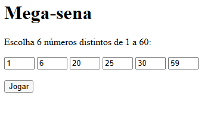
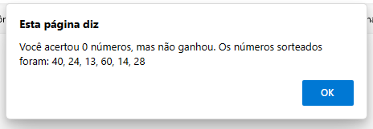

# javascript-Megasena-For-If-Else-Array
um projetinho de megasena com vários elementos no javascript
  

  <h3>Página inicial</h3>
  

  

  <h3>Sem vitória, mas pelo menos mostra os números. E é isto</h3>
  

